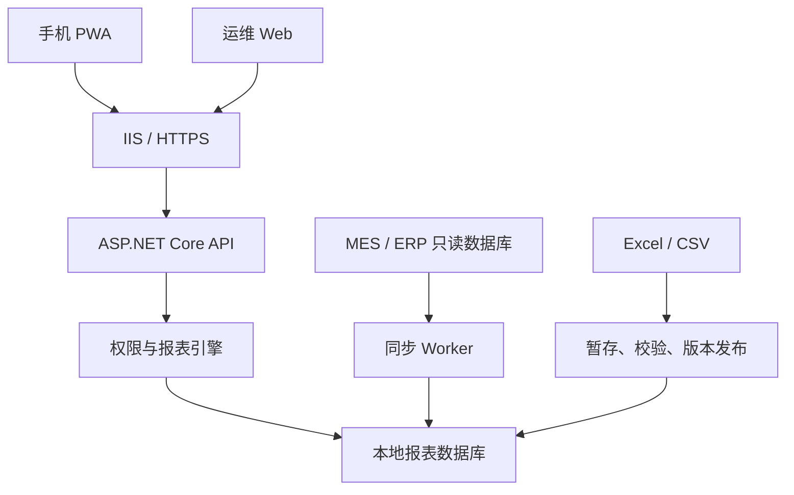

# 工厂移动报表平台开发规格（供 Cursor 使用）

版本：1.0  
日期：2026-09-13  
目标读者：产品负责人、C# 开发人员、Cursor 代码代理  

## 0. Cursor 执行说明

你正在开发一个部署于工厂局域网的移动报表平台。严格遵守本文件，不要擅自扩大第一版范围。

执行规则：

1. 开始编码前，先扫描仓库中的 `README.md`、`AGENTS.md`、解决方案文件和现有项目，不覆盖已有代码。
2. 如果仓库为空，按照第 5 节创建解决方案。
3. 每次只完成一个阶段。完成后运行构建和相关测试，汇报修改文件、命令结果和未解决问题。
4. 不允许在前端、日志、配置文件或源码中写入真实数据库密码。
5. 不允许手机端直接访问 MES 数据库。
6. 不允许普通管理员在页面中输入或执行任意 SQL。
7. 所有查询必须在服务端进行权限校验、参数校验、超时控制和最大行数限制。
8. 所有 JavaScript 依赖必须随系统部署，不依赖公网 CDN。
9. 新增业务功能时必须同时补充单元测试或集成测试。
10. 不使用占位实现假装功能完成。尚未实现的功能明确标记，并且不能进入验收清单。

推荐的 Cursor 工作方式：先让 Cursor 完成第 20 节的阶段 0，然后依次执行阶段 1～8。不要一次性要求生成整个系统。

### 0.1 Cursor 云端模式特别约束

Cursor 在云端开发环境运行，不在工厂局域网中。它只能负责代码生成、模拟数据测试、构建、单元测试、可执行部署包和部署文档，不能把“连接真实 MES”“验证现场 HTTPS”“完成现场上线”标记为已完成。

Cursor 必须遵守：

1. 不尝试连接任何工厂 IP、MES、ERP、现场数据库或内部域名。
2. 不要求用户把真实数据库密码、生产数据或内部证书上传到云端。
3. 使用接口抽象和脱敏模拟数据开发，例如 `IMesSourceReader` 与 `FakeMesSourceReader`。
4. 仓库中只提交 `.example` 配置、模拟数据和部署说明，不提交真实 Secret。
5. 云端至少运行 `dotnet build` 和不依赖现场环境的单元测试。
6. Oracle 集成测试优先通过 CI 服务容器执行；Cursor 环境支持 Docker 时才允许本地启动 Oracle 开发容器。【Oracle 版本待现场确认】
7. 无法运行 Oracle 容器时，明确报告“集成测试未执行”，不能用 EF InMemory 测试冒充 Oracle 集成测试。模拟数据不得连接数据库。
8. 现场部署、真实数据映射和数据口径核对必须作为人工交接任务保留。

---

## 1. 产品目标

建设一套在工厂局域网中运行的生产报表平台：

- 普通用户通过 Android 或 iPhone 浏览器访问响应式手机页面。
- 用户可将页面安装为 PWA，从手机桌面打开。
- 用户可查看生产、工单、质量等报表。
- 用户可调用手机后置摄像头扫描 QR Code 或 Code 128，并跳转到对应报表。
- 运维人员通过电脑 Web 后台管理用户、权限、数据源、数据集、Excel 导入和报表。
- 数据集支持数据库同步、Excel/CSV 导入及组合数据集。
- 整套系统部署在工厂局域网，不依赖公网服务。

### 1.1 第一版目标用户

- 工厂管理人员
- 生产经理
- 车间主任
- 班组长
- 质量管理人员
- 系统运维人员

### 1.2 第一版核心报表

1. 生产日报
2. 工单进度
3. 质量统计
4. 生产计划达成率（MES 实际产量＋Excel 计划数量）

### 1.3 第一版不做

- 手机报工、审批或修改 MES 生产数据
- 消息推送
- 多租户 SaaS
- 拖拽式 BI 建模
- 普通管理员编写任意 SQL
- Excel 宏、复杂公式和任意格式识别
- 长期离线使用
- 原生 Android/iOS 客户端
- 与公网云服务强绑定

---

## 2. 非功能目标

| 项目 | 第一版目标 |
|---|---:|
| 普通页面首屏 | 局域网内 2 秒以内 |
| 普通报表查询 | 3 秒以内 |
| 单次最大返回 | 1,000 行，默认 50 行分页 |
| 数据同步延迟 | 5 分钟以内 |
| 同时在线用户 | 50 人 |
| Excel 文件大小 | 最大 20 MB |
| Excel 数据行数 | 最大 50,000 行 |
| 可用浏览器 | Android Chrome、iOS Safari、桌面 Chrome/Edge |
| 权限越权 | 0 |
| MES 写操作 | 0 |

所有时间以服务器所在工厂时区为准。数据库统一保存 UTC 时间，并单独保存业务生产日期和班次。

---

## 3. 总体架构



统一入口建议：

```text
https://report.factory.example.com/mobile
https://report.factory.example.com/admin
https://report.factory.example.com/api
```

部署必须使用 HTTPS。同域部署，减少 CORS、Cookie 和证书问题。

---

## 4. 技术选型

| 模块 | 技术 |
|---|---|
| 手机端 | Blazor WebAssembly PWA |
| 运维后台 | Blazor Web App |
| API | ASP.NET Core Web API |
| UI | MudBlazor 或仓库现有组件库 |
| 图表 | Apache ECharts，本地打包 |
| 摄像头扫码 | `getUserMedia`＋ZXing-js，本地打包 |
| 身份认证 | ASP.NET Core Identity＋安全 Cookie |
| 配置数据 | EF Core＋Oracle（Oracle.EntityFrameworkCore）|
| 报表查询 | Dapper＋Oracle.ManagedDataAccess（ODP.NET）|
| 数据同步 | .NET Worker Service |
| Excel | ClosedXML，仅 `.xlsx` |
| CSV | CsvHelper |
| 日志 | Serilog，文件滚动＋数据库关键审计 |
| 校验 | FluentValidation |
| 测试 | xUnit＋WebApplicationFactory |
| 部署 | Windows Server＋IIS＋Windows Service |

使用当前受支持的 .NET LTS 版本。创建项目之前执行 `dotnet --info` 和 `dotnet new list`，以本机已安装的 LTS SDK 为准，不猜测模板参数。

Oracle 统一口径：

- 数据库使用 Oracle；禁止 SQL Server 专用代码、脚本、包与配置。
- 驱动：Oracle.ManagedDataAccess / ODP.NET；EF Core：Oracle.EntityFrameworkCore。
- Oracle 版本、Schema、字符集、连接方式、现场只读视图均为【待现场确认】。
- 批量写入如需使用，采用 ODP.NET 能力（如 OracleBulkCopy / 数组绑定），不得使用 SqlBulkCopy。
- 后续模拟数据不得连接数据库（Fake 内存/文件即可）。

---

## 5. 解决方案结构

```text
FactoryReport.sln

src/
  FactoryReport.MobilePwa/
  FactoryReport.AdminWeb/
  FactoryReport.Api/
  FactoryReport.Application/
  FactoryReport.Domain/
  FactoryReport.Infrastructure/
  FactoryReport.SyncWorker/
  FactoryReport.Shared/

tests/
  FactoryReport.UnitTests/
  FactoryReport.IntegrationTests/

deploy/
  iis/
  windows-service/
  oracle/

docs/
  architecture.md
  api.md
  deployment.md
  data-dictionary.md
  business-decisions.md
  source-mapping-template.md
```

依赖方向：

```text
MobilePwa ─┐
AdminWeb ──┼──> Shared
Api ───────┘

Api -> Application -> Domain
Infrastructure -> Application + Domain
SyncWorker -> Application + Infrastructure
```

`Domain` 不依赖 EF Core、Dapper、HTTP、UI 或具体数据库驱动。

---

## 6. 用户角色与权限

第一版角色：

- `SystemAdmin`：系统、数据源和数据集管理。
- `FactoryAdmin`：本工厂用户、权限和报表管理。
- `ReportDesigner`：报表展示配置、预览和发布。
- `DataImporter`：下载模板、上传文件、查看校验结果。
- `DataPublisher`：审核并发布或回退 Excel 数据版本。
- `ProductionManager`：查看授权生产报表。
- `QualityUser`：查看授权质量报表。
- `Viewer`：查看明确授权的报表。

权限分为：

1. 功能权限：能否查看、配置、导入、发布、导出。
2. 数据权限：能查看哪些工厂、车间和产线。

数据权限必须由 API 服务端追加到查询条件。前端隐藏菜单不等于权限控制。

建议权限编码：

```text
report.view
report.design
report.publish
report.export
dataset.view
dataset.manage
datasource.manage
import.upload
import.publish
import.rollback
user.manage
role.manage
audit.view
sync.manage
```

组织结构：

```text
Factory
  └─ Workshop
      └─ ProductionLine
```

用户数据范围至少包含 `FactoryId`，按需包含 `WorkshopId` 和 `ProductionLineId`。

---

## 7. 数据源与数据集模型

### 7.1 数据源类型

```csharp
public enum DataSourceType
{
    Oracle = 1,
    ExcelUpload = 2,
    CsvUpload = 3
}

public enum DatasetSourceType
{
    Database = 1,
    FileImport = 2,
    Composite = 3
}
```

### 7.2 数据库数据源

后台允许系统管理员维护：

- 名称和编码
- Oracle 主机 / 服务名（Service Name 或 SID）【待现场确认】
- Schema / 用户【待现场确认】
- 字符集【待现场确认】
- 认证与连接方式【待现场确认】
- 加密后的连接凭据引用
- 连接超时
- 查询超时
- 是否启用
- 测试连接
- 最后测试结果

认证方式【待现场确认】（数据库用户、Wallet、OS 认证等）。凭据必须通过 ASP.NET Core Data Protection 加密，并保证密钥目录仅服务账号可读。日志不得输出完整连接字符串。禁止使用 SQL Server 专用连接或驱动。

数据库连接账号必须只读。同步服务只读取允许的视图或存储过程。

### 7.3 数据库数据集

管理员可以选择已注册的数据源，并配置：

- 数据集名称、编码和说明
- 同步方式：全量或增量
- 源视图/存储过程
- 增量字段
- 主键字段
- 字段映射
- 同步频率
- 数据权限字段映射
- 最大单次读取数量

第一版不允许在 UI 中输入任意 SQL。复杂连接查询先由数据库管理员创建只读视图，系统只注册该视图。

### 7.4 Excel/CSV 数据集

每个文件数据集必须定义固定模板和字段：

- 字段编码和显示名称
- 文本、整数、小数、日期、布尔或枚举类型
- 是否必填
- 最大长度和数值范围
- 是否为业务唯一键
- 字典或组织校验规则
- 是否为数据权限字段
- 是否允许作为筛选、维度或指标

### 7.5 组合数据集

组合数据集只组合已注册数据集，不直接连接原始数据库。

第一版只实现一对一或多对一的等值关联，例如：

```text
MES 实际产量 + Excel 月度计划
关联键：FactoryId + WorkshopId + ProductionDate + ProductCode
计算：AchievementRate = ActualQuantity / PlanQuantity
```

必须定义零分母处理、缺失计划和缺失实际数据的显示规则。

---

## 8. 报表配置与运行时

### 8.1 报表生命周期

```text
Draft -> Validating -> Published -> Disabled
```

每次发布生成不可变版本。支持回退到上一已发布版本。

### 8.2 后台配置内容

- 基本信息：名称、编码、分类、说明、排序、图标。
- 数据集：选择一个已注册数据集。
- 筛选器：日期、日期范围、单选、多选、文本、扫码字段。
- 指标卡：字段、聚合、格式、单位、颜色规则。
- 表格：字段、标题、顺序、宽度、格式、是否排序、是否下钻。
- 图表：折线、柱状、饼图、横向排名。
- 权限：角色、查看、导出、明细权限。
- 限制：最大日期跨度、最大行数、默认分页大小。

### 8.3 运行时接口

```csharp
public interface IReportDatasetProvider
{
    string DatasetCode { get; }

    Task<DatasetQueryResult> QueryAsync(
        DatasetQuery query,
        UserDataScope scope,
        CancellationToken cancellationToken);
}
```

报表请求流程：

1. 验证登录状态。
2. 验证报表已发布。
3. 验证功能权限。
4. 加载用户数据范围。
5. 校验筛选字段、类型、日期跨度和分页。
6. 通过数据集注册表找到 Provider。
7. Provider 使用参数化 SQL 或已发布文件版本查询。
8. 应用查询超时和最大行数。
9. 记录查询审计，不记录敏感结果正文。
10. 返回统一结果。

### 8.4 统一响应

```json
{
  "reportCode": "production_daily",
  "title": "生产日报",
  "generatedAt": "2026-09-13T01:30:00Z",
  "dataUpdatedAt": "2026-09-13T01:29:00Z",
  "cards": [
    { "code": "actualQuantity", "title": "实际产量", "value": 12500, "unit": "件" }
  ],
  "series": [
    {
      "name": "小时产量",
      "type": "line",
      "categories": ["08:00", "09:00"],
      "values": [530, 620]
    }
  ],
  "columns": [
    { "field": "workOrderNo", "title": "工单", "type": "text" }
  ],
  "rows": [
    { "workOrderNo": "WO20260913001" }
  ],
  "paging": { "page": 1, "pageSize": 50, "total": 120 }
}
```

---

## 9. Excel/CSV 导入流程

### 9.1 支持范围

- `.xlsx` 和 `.csv`
- `.xlsx` 仅指定工作表
- 最大 20 MB
- 最大 50,000 数据行
- 固定模板版本
- 不支持 `.xlsm`、宏、加密文件和合并单元格数据
- 公式单元格默认拒绝，提示用户粘贴为值后重新上传

### 9.2 导入状态

```text
Uploaded
Parsing
ValidationFailed
ReadyToPublish
Publishing
Published
Withdrawn
Failed
```

### 9.3 服务端流程

1. 校验权限、扩展名、Content-Type、文件签名、大小。
2. 保存到受保护的临时目录，使用随机文件名。
3. 计算 SHA-256，检测重复上传。
4. 创建 `ImportBatch`。
5. 后台任务读取文件，不阻塞 HTTP 请求。
6. 校验模板编码、模板版本、表头和工作表。
7. 逐行类型校验、字典校验、组织校验和唯一键校验。
8. 错误写入 `ImportRowError`。
9. 有错误时不允许发布，但允许下载错误明细。
10. 无错误时生成新增、更新、重复和影响范围预览。
11. `DataPublisher` 确认后创建不可变 `DatasetVersion`。
12. 在一个数据库事务内写入版本记录和数据，并切换 ActiveVersionId。
13. 保留原文件、哈希、上传人、发布时间和模板版本。

### 9.4 导入模式

第一版支持：

- `Snapshot`：整份文件形成新版本。
- `ReplaceScope`：按工厂、月份等明确范围形成新版本。

第二版再考虑 `UpsertByBusinessKey`。

### 9.5 错误响应示例

```json
{
  "batchId": "01J...",
  "status": "ValidationFailed",
  "totalRows": 1250,
  "validRows": 1248,
  "errorRows": 2,
  "errors": [
    {
      "rowNumber": 15,
      "field": "ProductCode",
      "rawValue": "P9999",
      "message": "产品编码不存在"
    }
  ]
}
```

### 9.6 文件安全

- 上传目录不能作为静态网站目录。
- 禁止用户控制服务器文件名和路径。
- 不执行宏、不解析外部链接、不重新计算公式。
- 解析失败必须释放文件句柄并记录批次错误。
- 临时文件按策略清理，已发布原文件按审计策略保留。
- 错误导出中的文本字段必须防止公式注入。以 `=`, `+`, `-`, `@` 开头的用户文本在导出时进行安全处理。

---

## 10. 扫码功能

### 10.1 支持格式

第一版仅启用：

- QR Code
- Code 128

减少同时启用的识别格式有助于提高速度和降低误识别。

### 10.2 编码协议

```text
WO:202609130001
EQ:LINE01-MACHINE03
LOT:20260913-A001
```

二维码只保存对象类型和业务编号，不包含服务器地址、SQL 或敏感数据。

### 10.3 前端实现

- 使用 `navigator.mediaDevices.getUserMedia`。
- `facingMode` 优先设置为 `environment`。
- ZXing-js 通过本地 JavaScript bundle 加载，不使用 CDN。
- 只能在用户点击按钮后申请摄像头权限。
- 成功后停止视频轨道并释放摄像头。
- 页面离开、组件 Dispose 和异常时都必须释放。
- 提供手工输入作为兜底。
- 同一编码在 1 秒内重复识别时忽略。

### 10.4 解析接口

```http
POST /api/scanner/resolve
Content-Type: application/json

{ "rawCode": "WO:202609130001" }
```

服务端：

1. 限制编码长度。
2. 验证允许的前缀和字符。
3. 查询对象所属组织。
4. 验证当前用户数据权限。
5. 返回允许的站内路由。

不允许客户端提交任意跳转 URL。

---

## 11. 手机 PWA 页面

一级导航：

- 首页
- 报表
- 扫码
- 收藏
- 我的

### 11.1 移动端设计要求

- 以 360～430 CSS 像素宽度优先设计。
- 表格默认仅展示 3～5 个关键字段。
- 其余字段进入详情页或横向滚动区。
- 筛选项放入抽屉或底部面板。
- 点击区域不小于 44×44 CSS 像素。
- 图表支持横屏，但不能依赖横屏才能使用。
- 页面必须显示数据最后更新时间。
- 网络失败和无数据是不同状态。
- 数量、比例、日期使用统一格式。
- 业务标识如工单号必须按文本显示，不能转成科学计数法。

### 11.2 PWA 缓存策略

第一版只缓存应用壳、CSS、JavaScript、图标和非敏感字典。

不要由 Service Worker 缓存登录响应、报表数据、导出文件和管理接口。断网后可以保留当前页面内存中的数据，但新查询明确提示网络不可用。

发现新版本时显示“系统有新版本，点击刷新”。不要在用户填写筛选条件或导入文件时强制刷新。

---

## 12. Web 运维后台

菜单：

```text
首页
组织与用户
  组织机构
  用户管理
  角色权限
数据管理
  数据源
  数据集
  导入任务
  数据版本
报表管理
  报表列表
  报表设计
  发布记录
系统运维
  同步任务
  同步日志
  操作审计
  系统状态
```

报表设计第一版使用表单配置，不做自由画布拖拽。配置步骤：

1. 基本信息
2. 选择数据集
3. 筛选器
4. 指标卡
5. 图表
6. 表格列
7. 权限
8. 手机预览
9. 发布

发布前必须验证字段存在、类型匹配、权限字段可用、日期范围合理、至少有一个输出组件。

---

## 13. API 清单

### 13.1 认证

```text
POST /api/auth/login
POST /api/auth/logout
POST /api/auth/change-password
GET  /api/me
GET  /api/me/permissions
```

### 13.2 组织

```text
GET /api/organizations/factories
GET /api/organizations/workshops?factoryId=
GET /api/organizations/lines?workshopId=
GET /api/shifts
```

### 13.3 报表

```text
GET  /api/reports
GET  /api/reports/{code}/definition
POST /api/reports/{code}/query
POST /api/reports/{code}/drill-down
POST /api/reports/{code}/favorite
DELETE /api/reports/{code}/favorite
```

### 13.4 扫码

```text
POST /api/scanner/resolve
```

### 13.5 数据源和数据集

```text
GET  /api/admin/data-sources
POST /api/admin/data-sources
POST /api/admin/data-sources/{id}/test
GET  /api/admin/datasets
POST /api/admin/datasets
PUT  /api/admin/datasets/{id}
GET  /api/admin/datasets/{id}/fields
```

### 13.6 导入

```text
GET  /api/datasets/{id}/template
POST /api/datasets/{id}/imports
GET  /api/imports/{batchId}
GET  /api/imports/{batchId}/preview
GET  /api/imports/{batchId}/errors
GET  /api/imports/{batchId}/errors-file
POST /api/imports/{batchId}/publish
POST /api/datasets/{id}/versions/{versionId}/activate
GET  /api/datasets/{id}/versions
```

### 13.7 运维

```text
GET  /api/admin/sync-jobs
POST /api/admin/sync-jobs/{id}/run
GET  /api/admin/sync-jobs/{id}/logs
GET  /api/admin/audit-logs
GET  /api/health/live
GET  /api/health/ready
GET  /api/system/version
```

所有列表接口统一分页，并设置最大 `pageSize`。所有写接口启用防伪请求保护或等价 CSRF 防护。

---

## 14. 数据库设计

第一版使用一个 Oracle 数据库，通过 Schema（或等价命名空间）分区。【Oracle 版本、Schema 名称、字符集、连接方式待现场确认】分区示意：

```text
sec  身份、权限和组织
cfg  数据源、数据集和报表配置
imp  文件导入和版本
etl  数据同步
rpt  报表事实和维度数据
aud  审计
```

### 14.1 关键表

```text
sec.Organization
sec.UserDataScope
sec.Permission
sec.RolePermission

cfg.DataSource
cfg.Dataset
cfg.DatasetField
cfg.DatasetRelation
cfg.Report
cfg.ReportVersion
cfg.ReportPermission

imp.ImportTemplate
imp.ImportTemplateField
imp.ImportBatch
imp.ImportRowError
imp.DatasetVersion
imp.DatasetRecord

etl.SyncJob
etl.SyncCheckpoint
etl.SyncRun

rpt.DimFactory
rpt.DimWorkshop
rpt.DimProductionLine
rpt.DimShift
rpt.DimProduct
rpt.DimEquipment
rpt.FactProductionDaily
rpt.FactProductionHourly
rpt.FactWorkOrderProgress
rpt.FactQualityDaily
rpt.FactQualityDefect

aud.LoginLog
aud.OperationLog
aud.ReportQueryLog
```

### 14.2 文件数据记录

为了支持可配置字段，第一版可以使用 JSON 保存文件数据，同时抽取公共权限和索引字段：

```text
imp.DatasetRecord
- Id：【规划】GUID；Oracle 类型【待现场确认】（如 RAW(16) / VARCHAR2）
- DatasetVersionId：【规划】GUID；Oracle 类型【待现场确认】
- BusinessKey：【规划】字符串(500)；Oracle 类型【待现场确认】（如 NVARCHAR2）
- FactoryId：【规划】整数可空；Oracle 类型【待现场确认】（如 NUMBER）
- WorkshopId：【规划】整数可空；Oracle 类型【待现场确认】
- ProductionLineId：【规划】整数可空；Oracle 类型【待现场确认】
- BusinessDate：【规划】日期可空；Oracle 类型【待现场确认】（如 DATE）
- DataJson：【规划】大文本 JSON；Oracle 类型【待现场确认】（如 CLOB）
- RowNumber：【规划】整数；Oracle 类型【待现场确认】
- CreatedAt：【规划】UTC 时间戳；Oracle 类型【待现场确认】（如 TIMESTAMP WITH TIME ZONE）
```

索引：

- `(DatasetVersionId, BusinessKey)` 唯一索引
- `(DatasetVersionId, FactoryId, WorkshopId, BusinessDate)`

当某个文件数据集数据量或查询频率明显上升后，再将它物化为专用表。第一版不要提前为每种导入模板动态创建表。

### 14.3 并发控制

配置表增加乐观并发令牌（规划为 Version / RowVersion 字段；Oracle 具体类型与实现【待现场确认】，例如 NUMBER 版本列）。发布报表、发布数据版本和修改权限时使用乐观并发，冲突时提示用户刷新，而不是静默覆盖。

---

## 15. MES 同步服务

同步服务以 Windows Service 运行。

同步步骤：

1. 读取 `SyncCheckpoint`。
2. 使用只读连接增量读取源数据。
3. 映射工厂、车间、产线、产品、工单和班次。
4. 写入本地暂存集合。
5. 在事务中 Upsert 报表事实表。
6. 成功后更新 Checkpoint。
7. 写入 `SyncRun`。
8. 失败不推进 Checkpoint，并按有限次数重试。

需要处理：

- 夜班跨自然日
- 返工和重复报工
- 数据补录和冲销
- 工单关闭后的修订
- 源系统时间与服务器时间差异
- 同步中断后恢复

建议频率：

| 数据 | 频率 |
|---|---:|
| 首页和实际产量 | 1 分钟 |
| 工单进度 | 1～3 分钟 |
| 质量统计 | 3～5 分钟 |
| 基础资料 | 15 分钟 |
| 最近 7 天重算 | 每晚一次 |

同一任务不能并发执行。每批次控制事务大小，避免长事务影响 MES。

---

## 16. 安全要求

- 全站 HTTPS。
- Cookie 设置 `Secure`、`HttpOnly` 和合适的 `SameSite`。
- 登录、登出、权限变更后正确使会话失效。
- 密码使用 ASP.NET Core Identity 的标准哈希机制。
- 登录失败限流和临时锁定。
- 所有 API 默认要求认证，只有健康检查和登录例外。
- 每个报表请求都进行功能权限和数据权限检查。
- Dapper 查询只使用参数化值。
- 标识符来自服务器白名单，不接受客户端表名、列名或排序 SQL。
- 设置 SQL CommandTimeout。
- 限制日期跨度、分页大小和导出数量。
- MES 连接只读。
- 数据库凭据加密，日志脱敏。
- 上传文件存放在非 WebRoot 目录。
- 上传文件大小、格式、签名和模板全部校验。
- 错误信息对用户友好，但不泄露堆栈、SQL 和服务器路径。
- 审计用户、时间、IP、对象、操作和结果。

建议为导出文件增加用户名、时间和工厂名称水印。第一版可默认关闭导出，权限和数据量限制完成后再启用。

---

## 17. 日志、监控与备份

### 17.1 日志

Serilog 输出：

- `logs/api-.log`
- `logs/admin-.log`
- `logs/sync-.log`

按天滚动，设置保留天数。结构化字段至少包含 `TraceId`、`UserId`、`RequestPath`、`ElapsedMs` 和结果状态。

不得记录密码、Cookie、完整连接字符串、Excel 文件正文和报表敏感结果。

### 17.2 健康检查

- `live`：进程存活。
- `ready`：本地数据库、Data Protection 密钥和必要依赖正常。
- MES 数据源故障不应让 API 的 `live` 失败，但应在同步状态中告警。

### 17.3 备份

- Oracle 每日完整备份（RMAN 或现场既定策略）【待现场确认】。
- 按需要增加归档日志 / 增量备份【待现场确认】。
- Data Protection 密钥目录纳入备份。
- 已发布 Excel 原文件和版本元数据纳入备份。
- 至少执行一次恢复演练，并记录恢复步骤。

---

## 18. 测试要求

### 18.1 单元测试

- 数据权限合并
- 日期范围校验
- 班次跨天计算
- 达成率零分母处理
- 扫码前缀解析
- Excel 字段类型校验
- 唯一键生成
- 导入版本状态流转

### 18.2 集成测试

- 未登录访问返回 401。
- 无权限报表返回 403。
- 用户不能查询其他车间数据。
- 查询参数不会绕过数据范围。
- Excel 有错误时不能发布。
- 发布新版本后报表读取新版本。
- 回退后报表读取旧版本。
- 同步失败不推进 Checkpoint。
- 并发发布只允许一个成功。

### 18.3 浏览器测试

- Android Chrome 登录和添加到桌面。
- iOS Safari 登录和摄像头授权。
- QR Code 和 Code 128 扫描。
- 拒绝摄像头权限后的手工输入。
- 网络断开和恢复。
- PWA 新版本刷新提示。
- 360、390、430 像素宽度页面检查。

### 18.4 性能测试

- 50 个用户并发读取首页。
- 20 个用户并发执行常用报表。
- 50,000 行 Excel 导入。
- 同步 Worker 运行时执行报表查询。

---

## 19. 验收标准

满足以下全部条件才算第一版完成：

1. Android Chrome 和 iOS Safari 可通过局域网 HTTPS 登录。
2. 手机页面可以安装到桌面。
3. 三张基础报表和一张计划达成报表可用。
4. 报表数据与 MES 抽样核对一致。
5. Excel 计划模板可下载、上传、校验、预览、发布和回退。
6. QR Code 和 Code 128 可以调用后置摄像头识别。
7. 扫工单码可打开工单进度，并执行服务端权限检查。
8. 管理员可以配置已有数据集的筛选器、卡片、图表和表格列。
9. 发布新报表后手机端无需重新部署即可看到。
10. 不同车间用户不能查看彼此数据。
11. 常用报表在目标数据量下 3 秒内返回。
12. MES 同步失败可查看日志并重试。
13. 日志中没有密码、Cookie 和完整连接字符串。
14. 数据库备份和恢复步骤经过验证。

---

## 20. 分阶段开发任务（直接交给 Cursor）

### 阶段 0：业务数据字典

目标：先确认数据口径，不写业务页面、不安装依赖、不部署、不连接 Oracle/MES。

产出：

- `docs/data-dictionary.md`（字段名、类型、含义、来源为规划口径；Oracle 类型映射【待现场确认】）
- `docs/business-decisions.md`（区分：已确认产品规则 / Fake 测试临时口径 / 必须现场确认的 Oracle·MES 映射项）
- `docs/source-mapping-template.md`（MES/ERP → 报表字段映射模板，全部留空待现场确认）
- 三张基础报表的字段、公式、来源、筛选和权限字段
- Excel 生产计划模板的字段定义
- 夜班跨天、返工、补录和冲销规则
- 全库文档统一为 Oracle 方案（ODP.NET + Oracle.EntityFrameworkCore）

验收：每个指标都能追溯到明确的数据来源和计算公式。信息不足时生成待确认清单，不自行发明口径。本阶段不执行构建与测试。

### 阶段 1：解决方案骨架

目标：创建第 5 节项目结构。

要求：

- 配置分环境管理。
- 增加统一错误响应和 TraceId。
- 接入 Serilog。
- 建立最小健康检查。
- 创建测试项目。

验收：`dotnet build` 和空测试集成功；API 的 `/api/health/live` 返回成功。

### 阶段 2：认证、组织和权限

目标：实现登录、用户、角色、权限和数据范围。

要求：

- 使用 ASP.NET Core Identity。
- Cookie 安全配置。
- 提供初始化管理员的安全方式。
- 实现功能权限 Policy。
- 实现数据范围服务。

验收：集成测试证明普通用户无法访问后台或其他车间数据。

### 阶段 3：数据源与同步

目标：注册 Oracle 数据源和第一个生产数据集。

要求：

- 测试连接。
- 凭据保护。
- 只读视图读取。
- Worker 增量同步和 Checkpoint。
- 同步运行日志。

验收：模拟源数据库增加记录后，Worker 能同步到本地报表表；失败时不推进 Checkpoint。

### 阶段 4：报表引擎与生产日报

目标：打通第一张报表。

要求：

- 实现数据集 Provider 注册表。
- 实现报表定义、版本和发布。
- 实现筛选器、指标卡、图表和表格响应。
- 实现分页、超时和最大行数。
- 完成生产日报手机页面。

验收：生产日报与测试数据一致；越权测试通过；常用查询达到性能目标。

### 阶段 5：Excel 导入与组合数据集

目标：导入月度生产计划并形成达成率报表。

要求：

- 下载固定模板。
- 上传批次、异步解析、逐行校验。
- 错误明细下载。
- 发布快照版本和回退。
- MES 实际产量与 Excel 计划组合。

验收：错误文件不能发布；正确文件发布后手机显示新计划；回退后恢复旧数据。

### 阶段 6：扫码

目标：支持 QR Code 和 Code 128。

要求：

- ZXing 和相关脚本本地部署。
- 后置摄像头优先。
- 生命周期结束时释放摄像头。
- 支持手工输入。
- 服务端解析并检查数据权限。

验收：Android Chrome 和 iOS Safari 实机测试通过；无权限编码返回 403 或无权访问结果。

### 阶段 7：运维后台

目标：完成可运维闭环。

要求：

- 用户、角色、数据权限。
- 数据源、数据集、导入任务和版本。
- 报表设计、预览、发布和回退。
- 同步任务、日志和审计。

验收：管理员无需改代码即可基于已有数据集创建一张简单报表并发布到手机端。

### 阶段 8：部署和试运行

目标：生成可供现场人员执行的部署包、配置模板和上线手册。Cursor 云端不直接完成局域网上线。

要求：

- IIS 发布脚本或清晰步骤。
- HTTPS、内部 DNS 和证书说明。
- Worker Windows Service 安装步骤。
- SQL 初始化和迁移步骤。
- 备份恢复说明。
- PWA 更新策略。
- `appsettings.Production.example.json`，只包含占位符。
- 现场 Secret 配置说明，不包含真实值。
- 发布产物生成命令和校验清单。
- 从模拟数据切换到真实 MES Provider 的明确步骤。

云端验收：发布命令成功，部署包结构完整，文档列出所有现场前置条件。  
现场验收：现场人员在一台干净服务器上依据文档完成部署；手机扫码 URL 后能够登录和查询。现场验收不能由 Cursor 云端代替。

---

## 21. Cursor 每阶段通用提示词

将下面内容与某个阶段的要求一起交给 Cursor：

```text
请严格按照 FactoryReport_Cursor_Development_Spec.md 执行当前阶段。

开始前：
1. 阅读仓库结构、现有代码和适用的 AGENTS.md。
2. 列出当前阶段的实现计划和预计修改文件。
3. 指出规范中仍缺失且会阻塞编码的信息，不要自行虚构业务口径。

实现时：
1. 只修改当前阶段需要的内容。
2. 保持依赖方向正确。
3. 不写入真实密码或连接字符串。
4. 所有数据库访问使用参数化查询。
5. 所有权限在服务端验证。
6. 为关键业务规则增加测试。

完成后：
1. 运行格式化、构建和相关测试。
2. 汇报实际修改文件。
3. 汇报命令执行结果。
4. 汇报剩余风险和下一阶段前置条件。
5. 如果测试失败，继续修复，不要把失败结果描述为完成。
```

---

## 22. 上线前必须由业务人员确认

以下内容不能由 Cursor 猜测：

- MES / 报表 Oracle 版本与部署形态【待现场确认】
- MES 可用只读视图或表
- 工单、产品、车间和产线主键
- 生产日期与自然日期的关系
- 夜班归属规则
- 实际产量是否扣除返工、报废和冲销
- 良率的分子和分母
- 工单延期判断规则
- Excel 生产计划的唯一键和覆盖范围
- 组织和角色权限矩阵
- 工厂域名、证书和内部 DNS 条件
- 服务器操作系统和 Oracle 版本【待现场确认】
- 数据保留、审计和备份周期

先确认上述内容，再接入真实 MES。开发环境只能使用脱敏样例数据。

---

## 23. 云端开发与现场部署工作流

### 23.1 环境划分

| 环境 | 位置 | 数据 | 用途 |
|---|---|---|---|
| Cursor Cloud | 云端 | 脱敏 JSON/CSV 模拟数据 | 编码、构建、单元测试 |
| CI | 云端流水线 | 临时 Oracle 测试库【版本待现场确认】 | 数据库迁移和集成测试 |
| Factory Test | 工厂局域网 | 脱敏或测试库 | 接口、证书、网络和数据映射验证 |
| Production | 工厂局域网 | 正式报表库＋MES 只读源 | 正式运行 |

禁止从 Cursor Cloud 或普通 CI 直接访问 Production。

### 23.2 必须建立的抽象

```csharp
public interface IMesSourceReader
{
    Task<IReadOnlyList<MesProductionRecord>> ReadProductionAsync(
        SyncCheckpoint checkpoint,
        CancellationToken cancellationToken);
}
```

实现：

```text
FakeMesSourceReader     云端开发和演示（内存/文件，不连库）
OracleMesSourceReader    工厂测试和生产（ODP.NET）
```

通过配置选择实现：

```json
{
  "MesSource": {
    "Provider": "Fake"
  }
}
```

生产配置使用 `Oracle`，但连接凭据通过现场 Secret 或受保护配置注入，不写进 JSON。

同样为文件存储、当前时间和后台任务建立可替换抽象：

```text
IImportFileStore
IClock
IReportDatasetProvider
ISyncCheckpointStore
```

### 23.3 云端模拟数据

仓库增加：

```text
tests/Fixtures/
  factories.json
  workshops.json
  production-daily.json
  work-orders.json
  quality.json
  monthly-plan-valid.xlsx
  monthly-plan-invalid.xlsx
```

模拟数据必须虚构，不得使用真实客户名称、工单、产品、人员或设备编号。

模拟数据至少覆盖：

- 白班和跨天夜班
- 正常工单和延期工单
- 返工、报废和冲销
- 缺少生产计划
- 计划数量为零
- 无权限车间
- Excel 重复唯一键
- Excel 不存在的产品编码
- QR Code 和 Code 128 示例值

### 23.4 云端数据库测试

优先顺序：

1. Cursor Cloud 支持 Docker：使用 `docker-compose.dev.yml` 启动 Oracle 测试容器（镜像与版本【待现场确认】）。
2. Cursor Cloud 不支持 Docker：运行不依赖 Oracle 的构建和单元测试，把数据库集成测试交给 CI；Fake 模拟不得连接数据库。
3. CI 使用临时 Oracle 服务容器，运行 EF Core Migration 和集成测试。

不使用真实 MES 数据库完成自动化测试。不因为云端无法访问 Oracle 就把生产实现改成 SQL Server 或其他不兼容数据库。禁止引入 Microsoft.Data.SqlClient、SqlBulkCopy 等 SQL Server 专用组件。

### 23.5 配置文件规则

允许提交：

```text
appsettings.json
appsettings.Development.example.json
appsettings.Production.example.json
.env.example
```

禁止提交：

```text
appsettings.Production.json
.env
真实证书私钥
真实连接字符串
数据库备份
生产 Excel 文件
```

在 `.gitignore` 中明确排除这些敏感文件。

### 23.6 云端交付物

Cursor 每个可部署里程碑应生成：

- 可构建源代码
- 数据库 Migration
- 脱敏 Seed 数据
- 单元测试和集成测试
- `docker-compose.dev.yml`（环境允许时使用）
- API OpenAPI 文档
- 发布命令或脚本
- IIS 部署说明
- Windows Service 安装说明
- 现场配置清单
- 数据库映射待确认清单
- 已执行与未执行测试清单

### 23.7 现场交接步骤

现场人员执行：

1. 从 Git 仓库拉取已审核版本或取得发布包。
2. 在工厂服务器安装 .NET Hosting Bundle、IIS 和 Oracle 客户端/驱动依赖（ODP.NET 托管驱动优先；现场附加组件【待现场确认】）。
3. 配置内部 DNS 和 HTTPS 证书。
4. 创建本地报表数据库并运行 Migration。
5. 通过现场 Secret 注入数据库连接信息。
6. 创建 MES 只读账号或只读视图。
7. 将 `MesSource.Provider` 从 `Fake` 切换为 `Oracle`。
8. 完成字段映射和数据口径配置。
9. 先连接 MES 测试库或受控只读范围。
10. 对生产日报、工单进度和质量统计逐项核对。
11. 使用手机验证局域网、PWA、摄像头权限和扫码。
12. 完成备份恢复演练后再正式启用。

### 23.8 交付边界

Cursor 可以声明完成：

- 功能代码已实现。
- 构建成功。
- 单元测试成功。
- CI 中 Oracle 集成测试成功。
- 发布包和部署文档已生成。

Cursor 不可以在没有现场证据时声明完成：

- 已连接真实 MES。
- 数据口径与正式 MES 一致。
- 局域网 DNS 和证书可用。
- 手机在现场 Wi-Fi 中可访问。
- 生产备份和恢复已验证。
- 系统已经正式上线。
